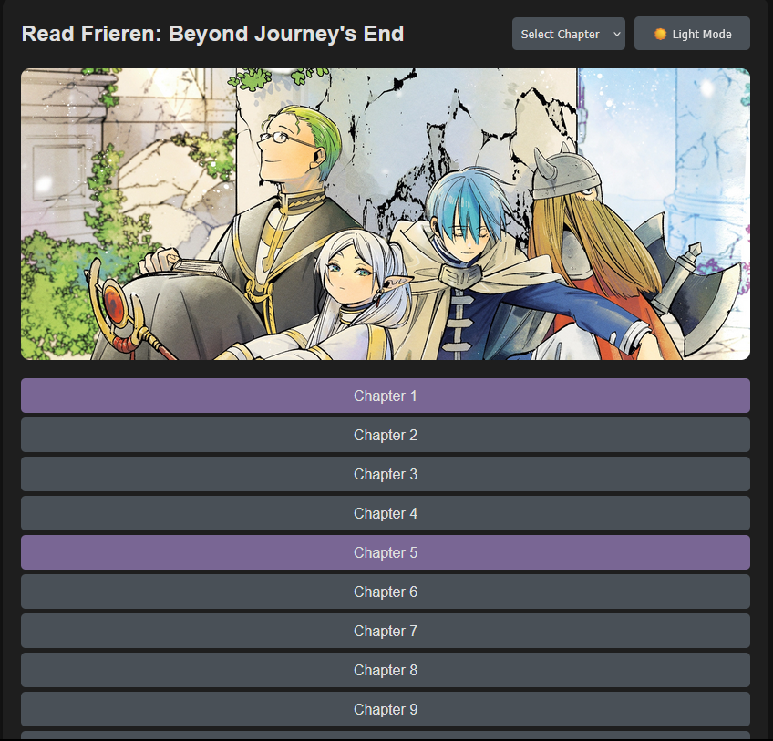

# Manga Reader

A simple and modern web application to read manga online. This project fetches manga data from the [MangaDex API](https://api.mangadex.org/) and allows users to read chapters seamlessly. It supports dark mode, responsive design, and quick chapter navigation.

 <!-- Add a screenshot if you have one -->
 <!-- Add a screenshot if you have one -->

## Features

- **Read Manga Online**: Fetch and read manga chapters directly from MangaDex.
- **Dark Mode**: Toggle between light and dark mode for comfortable reading.
- **Responsive Design**: Works on all devices, from desktops to mobile phones.
- **Quick Chapter Navigation**: Use the dropdown to jump to any chapter instantly.
- **Donation and Discord Links**: Support the project and join the community.

## How to Use

1. **Visit the Site**: Open the hosted site on Netlify or your local server.
2. **Select a Chapter**: Use the dropdown in the header or click on a chapter link to start reading.
3. **Toggle Dark Mode**: Click the dark mode toggle button to switch between light and dark themes.
4. **Navigate Chapters**: Use the previous/next buttons or the dropdown to navigate between chapters.

## Changing the Manga

By default, the site displays chapters for *Frieren: Beyond Journey's End*. You can change the manga by updating the manga ID in the code.

### Steps to Change the Manga

1. **Find the Manga ID**:
   - Go to [MangaDex](https://mangadex.org/) and search for the manga you want to display.
   - Copy the manga ID from the URL. For example, the ID for *Frieren: Beyond Journey's End* is `b0b721ff-c388-4486-aa0f-c2b0bb321512`.

2. **Update the Code**:
   - Open `script.js` and `chapter-script.js` in your code editor.
   - Locate the `mangaId` variable:
     ```javascript
     const mangaId = 'b0b721ff-c388-4486-aa0f-c2b0bb321512'; // Replace with your manga ID
     ```
   - Replace the default ID with the new manga ID.

3. **Save and Deploy**:
   - Save the changes and redeploy the site (if hosted on Netlify or another platform).

## Hosting on Netlify

To host this project on Netlify:

1. Push the project to a GitHub repository.
2. Log in to [Netlify](https://www.netlify.com/) and connect your GitHub repository.
3. Deploy the site. Netlify will automatically build and host your project.

## Technologies Used

- **HTML**: Structure of the site.
- **CSS**: Styling and responsive design.
- **JavaScript**: Fetching data from the MangaDex API and handling user interactions.
- **MangaDex API**: Source of manga data.

## Contributing

Contributions are welcome! If you'd like to improve this project, please follow these steps:

1. Fork the repository.
2. Create a new branch (`git checkout -b feature/YourFeatureName`).
3. Commit your changes (`git commit -m 'Add some feature'`).
4. Push to the branch (`git push origin feature/YourFeatureName`).
5. Open a pull request.

## License

This project is licensed under the GPL-3.0 license. See the [LICENSE](LICENSE) file for details.

---

Enjoy reading! 📚
